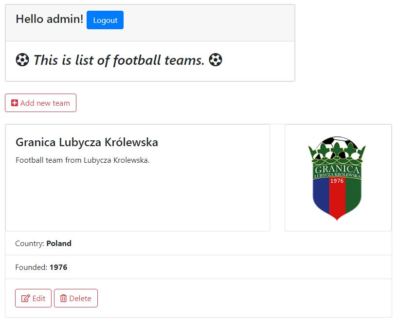

# django Football Clubs list

##### Simple web app created with django.
Screenshoot from app: 

##
## Tables of Contents   
* General info
* Technologies
* Setup
* Status
* Features
* Sources
* Contact

### General info
This app was made to fix django Framework in my brain which I learnt on Python Bootcamp.

### Technologies
* Python 3.8.0
* Django 3.0.2
* Django Rest Framework 3.11.0
* Bootstrap 4.4.1
* Pillow 7.0.0
* python-decouple 3.3
* dj-static 0.0.6

### Setup
To use this project follow these steps:

1. Create your working environment
2. Install Django
3. Install python decouple
4. Install django-bootstrap-form
5. Install djangorestframework
6. Install pillow
7. Install dj-static

### Features
* Add your favourite club with club crest to app.
* Add  players to your team.
* Add sponsors who support your team.

### Sources
This app is inspired by Krystian Czekalski video „Django 2.0 po polsku (podstawy)”.

### Contact
Created by Kamil Zazula - feel free to contact me!
>
> GitHub [@kamilzazi](https://github.com/kamilzazi) &nbsp;&middot;&nbsp;
> e-mail [zazi124@op.pl]()